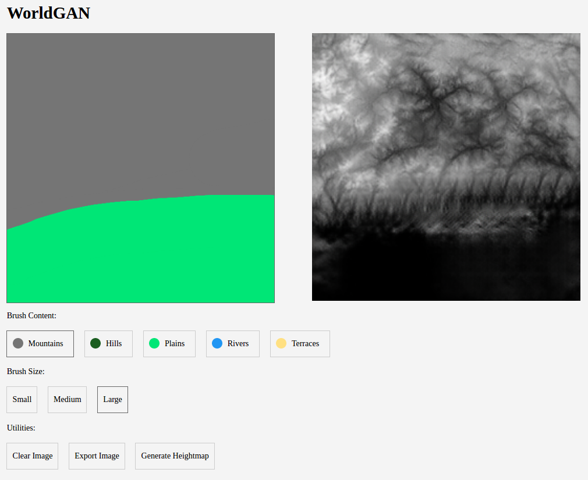
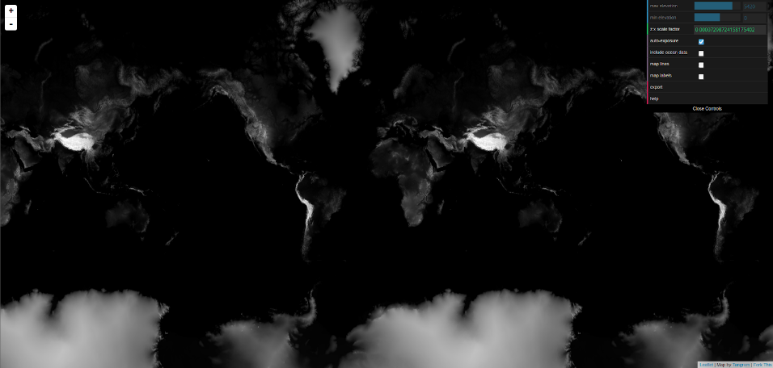

# WorldGAN

3D Environment Generation Using Deep Conditional Generative Adversarial Networks


## Videos

- Checkpoint 1: https://www.youtube.com/watch?v=jP5bdHnInEw
- Checkpoint 2: https://www.youtube.com/watch?v=-EoIp0KwEag
- Checkpoint 3: https://www.youtube.com/watch?v=YByEOAzlYIo
- Checkpoint 4: https://www.youtube.com/watch?v=OBWqvTyUInY
- Checkpoint 5: https://www.youtube.com/watch?v=SpBx00NE8ss
- Demo: https://www.youtube.com/watch?v=pADYl1LY1hA

## Folder Structure

Below I outline all the folders for thir project

### /app

The user interface application. Built on top of the Flask Python webserver. Interactivity is all done with client side javascript.

Requirements:

- Python 3.6+
- Flask

To run model inference you need to also have:
- Pytorch
- Torchvision

Change to the app directory and run with:

```
env FLASK_APP=server.py flask run
```



### /data

Contains training and test data sets. In the batch folders, the data is structured to work by default with the pix2pix and cyclegan training code.

- /original-batch contains a set of 258 paired usermaps and heightmaps
- /augmented-batch contains a training set of our original batch along with flipped, mirrored, and rotated images
- /screenshots contain a variety of outputs and training captures
- /test-set contains a collection of 10 hand drawn usermaps for evaluation
- /working is an "in-progress" folder containing a lot of heightmaps

### /models

Contains all of our trained models and test results. These pth files can be loaded with pytorch, or called by the app or pytorchh-cyclegan-and-pix2pix projects.

### /pytorch-CycleGAN-and-pix2pix

The open source repo for our GAN architectures. Refer to https://github.com/junyanz/pytorch-CycleGAN-and-pix2pix for more documentation.

To train the 4 models, navigate to this directory and run:

```
python3 train.py --dataroot ../data/original-batch/cycle --name one-cyclegan --model cycle_gan
python3 train.py --dataroot ../data/augmented-batch/cycle --name two-cyclegan --model cycle_gan
python3 train.py --dataroot ../data/original-batch/p2p --name one-pix2pix --model pix2pix
python3 train.py --dataroot ../data/augmented-batch/p2p --name two-pix2pix --model pix2pix
```

To perform inference on the models:

```
python3 test.py --dataroot ../data/test-set --name one-pix2pix --model pix2pix --load_size 256
python3 test.py --dataroot ../data/test-set --name two-pix2pix --model pix2pix --load_size 256
python3 test.py --dataroot ../data/test-set --name one-cyclegan --model test --no_dropout --preprocess none
python3 test.py --dataroot ../data/test-set --name two-cyclegan --model test --no_dropout --preprocess none
```

### Utilities

Contains a small number of apps and programs to help with data collection.

#### Data Augmentator

A python program to augment images in a directory with 5 operations: mirror, flip, rotate 90, rotate 180, and rotate 270.

Requires python imaging library.

#### Heightmapper

An open source interactive map published by mapzen. Contains world elevation data gathered by NASA, USGS, and the NGA. Adds a tilesLoaded hook to be able to be used with my generator program.

Change to directory and run with:

```
python3 -m http.server
```



#### Data Generator

A node.js program used to control a headless browser. This program loads a random coordinate, waits for the tiles to load, checks if the elevation is usable (not over water), and saves it. Can be used asychrounously. Needs to be used in conjunction with heightmapper. Need to install npm and node for this to work. Dependecies can be installed with npm.

Navigate to directory and run with:

```
npm install
npm start
```

### /writing

Paper and proposal latex and pdf files. Also contains the repo for the project description website and a power point presentation.